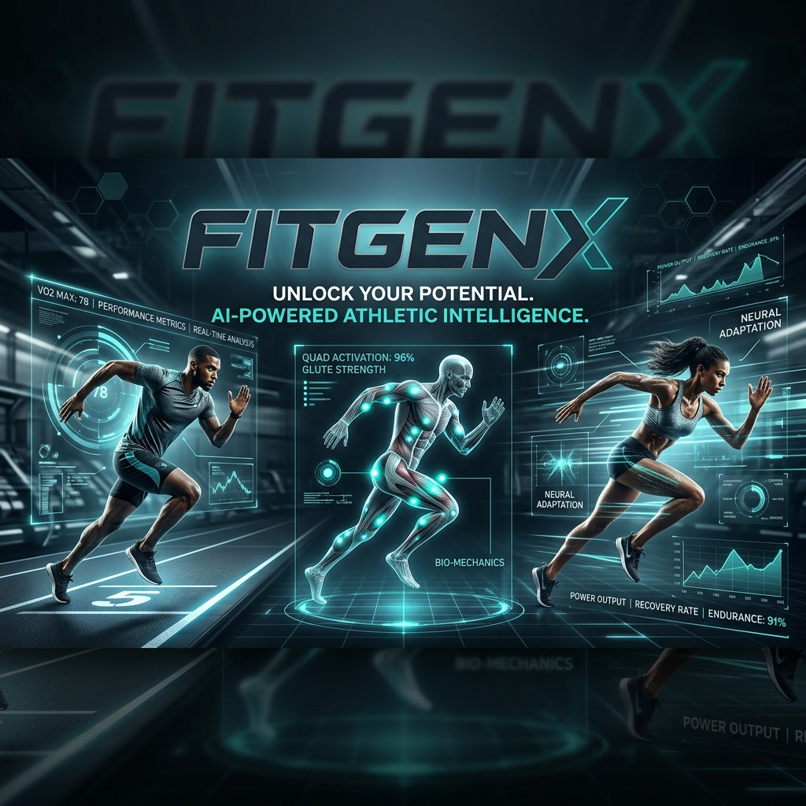

# ⚡ Aura FitGenX



> **The Future of Human Performance.**  
> A high-performance athletic intelligence platform optimized for elite performance.

Aura FitGenX is a premium fitness ecosystem designed for the modern athlete. It combines photorealistic 3D avatar evolution, AI-driven coaching, and an immersive editorial social experience into a single seamless interface.

---

## ✨ Core Pillars

### 🤖 Aura AI Coach
Your advanced intelligence core provides data-driven, professional coaching. From powerlifting optimization to cardiovascular peak-performance, Aura analyzes your intent and provides real-time strategic feedback.

### 📱 Kinetic Editorial Social
An immersive, Instagram-inspired social feed designed for performance sharing.
- **Immersive Stories**: Fully interactive fullscreen story player with segmented progress bars and gesture controls.
- **Metric Overlays**: Posts automatically feature floating heart rate, pace, and intensity data.
- **Kinetic Design**: Smooth 60fps animations powered by Framer Motion.

### 🐾 Creature Companion (New!)
The core of your fitness journey. Evolve your digital companion by completing workouts.
- **7 Evolutionary Stages**: From an Egg to an Ancient Dragon.
- **XP Progression**: Gain XP based on workout volume and intensity.
- **Dynamic Feedback**: Your creature grows and glows as you hit your weekly goals.
- **Configurable Hub**: Access your creature instantly from the smart navigation center button.

---

## 🛠️ Technology Stack

- **Frontend**: React 18 + Vite (TypeScript)
- **Styling**: Tailwind CSS + Custom Design Tokens
- **AI Engine**: Advanced Neural Athletic Intelligence
- **Animations**: Framer Motion
- **Icons**: Google Material Symbols (Variable)
- **Deployment**: Vercel

---

## 🚀 Getting Started

### 1. Prerequisites
- [Bun](https://bun.sh/) or [Node.js](https://nodejs.org/)
- Google AI Studio API Key

### 2. Installation
```bash
git clone https://github.com/MayankSen09/FitgenX-AI.git
cd FitgenX-AI
bun install
```

### 3. Environment Setup
Create a `.env` file in the root directory:
```env
VITE_GEMINI_API_KEY=your_gemini_api_key_here
```

### 4. Run Locally
```bash
bun run dev
```

---

## 🌐 Production Deployment

The project is optimized for deployment on **Vercel**. 

**Note for SPA Routing:**
The project includes a `vercel.json` configuration to handle Single Page Application (SPA) routing. This ensures that direct links and page refreshes work perfectly on the live site.

**Environment Variables:**
Ensure you add `VITE_GEMINI_API_KEY` to your Vercel Project Settings under "Environment Variables" before deploying.

---

## 🎨 Design System
Aura follows the **Kinetic Editorial** design language—a synthesis of high-end fashion editorial layouts and futuristic data visualization.

- **Primary Colors**: Deep Zincs, Galactic Whites
- **Accents**: Vitality Teal, Performance Blue
- **Typography**: Inter (UI), Outfit (Headline)

---

## 📄 License
This project is licensed under the MIT License - see the [LICENSE](LICENSE) file for details.

Developed with ⚡ by Antigravity.
